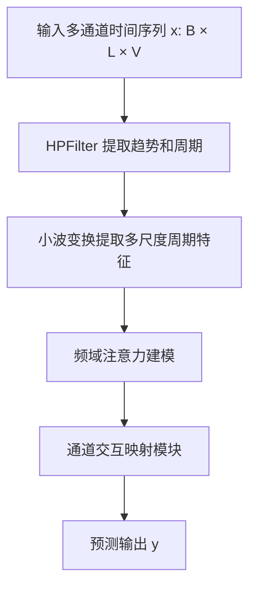

# 基于深度学习的时间序列预测系统文档

## 1. 项目背景与动机

### 实际背景

在现代社会中，**交通、电力、气象等多个领域**都需要对时间序列数据进行准确预测。传统预测模型难以捕捉非线性趋势与复杂周期性结构，导致预测精度有限。

### 项目动机

本项目提出一个**基于小波变换与 HP 滤波器融合的时间序列预测模型（HPFilterNet）**，旨在提升对长序列、多通道数据的趋势与周期建模能力，从而提高预测精度。

---

## 2. 研究现状与方法分类

### 当前主流方法：

| 方法类别                | 代表方法                                         | 特点                      |
| ------------------- | -------------------------------------------- | ----------------------- |
| 统计方法                | ARIMA、Holt-Winters                           | 简单易用，适合线性数据             |
| 基于 RNN 的深度学习方法      | LSTM, GRU                                    | 能建模短期记忆，但难以处理长依赖        |
| 卷积-Transformer 混合模型 | Informer, Autoformer                         | 强大的建模能力，适合长序列预测         |
| **频域/时频域方法（本项目）**   | iTransformer, FEDformer, **HPFilterNet（本文）** | 引入频域/小波域先验，有助于建模趋势与周期结构 |

### 我们的方法：

本项目属于**时频域建模类方法**，融合 **HP 滤波器** 和 **连续小波变换（CWT）**，分别用于提取趋势分量与周期信息。

---

## 3. 方法介绍

### 总体流程图



---

### 3.1 HP 滤波器：提取趋势与周期

#### 数学公式

$$
\min_{\tau} \sum_{t=1}^T (x_t - \tau_t)^2 + \lambda \sum_{t=2}^{T-1} ((\tau_{t+1} - \tau_t) - (\tau_t - \tau_{t-1}))^2
$$

#### PyTorch 实现

```python
class HPFilter(nn.Module):
    def forward(self, x):  # x: [B, L, V]
        B, L, V = x.shape
        I = torch.eye(L, device=x.device)
        D = (torch.diag(torch.ones(L-1), -1) - 2 * torch.eye(L) + torch.diag(torch.ones(L-1), 1))[1:-1]
        A = I + self.lambda_hp * D.T @ D
        x_reshaped = x.permute(1, 0, 2).reshape(L, -1)
        trend = torch.linalg.solve(A, x_reshaped).reshape(L, B, V).permute(1, 0, 2)
        cycle = x - trend
        return cycle, trend
```

---

### 3.2 小波周期提取模块

#### 核心过程

* 使用 Morlet 小波提取多尺度周期信号；
* 对不同频率尺度进行门控建模，突出显著周期；
* 高维周期特征通过多个全连接层融合。

#### 关键函数

```python
def Wavelet_for_Period_Batch(x, scale=16, num_scales=16):
    B, V, D = x.shape
    x = x.permute(0, 2, 1).reshape(B * D, V)
    scales = 2 ** np.linspace(-1, scale, num_scales)
    coeffs, freqs = ptwt.cwt(x, scales, "morl")
    coeffs = torch.tensor(coeffs.permute(1, 0, 2).reshape(B, D, -1, V), dtype=torch.float32)
    return coeffs, freqs
```

#### 模块核心前向传播逻辑：

```python
def forward(self, x):
    coeffs, freqs = Wavelet_for_Period_Batch(x, self.scale, self.num_scales)
    h_coeffs = torch.einsum("bdsv,sv->bdv", coeffs, self.w1)
    h = torch.matmul(h_coeffs.permute(0, 2, 1), self.wf1) + self.bf1.view(1, 1, -1)
    h = h.permute(0, 2, 1)
    h = torch.matmul(h, self.wf2)
    h = torch.matmul(h, self.wf3)
    return h + x  # 残差连接
```

---

## 4. 软件使用说明

### 模型训练（基于 PyTorch）

```bash
from fastapi import FastAPI
from pydantic import BaseModel
from typing import Optional

app = FastAPI()

# 定义输入参数模型
class PredictParams(BaseModel):
    is_training: int = 1
    root_path: str = "./dataset/ETT-small/"
    data_path: str = "ETTh2.csv"
    model_id: str = "ETTh2_96_96"
    model: str = "HPFilterNet"
    data: str = "ETTh2"
    features: str = "M"
    seq_len: int = 96
    label_len: int = 48
    pred_len: int = 96
    e_layers: int = 1
    d_layers: int = 2
    lambda_hp: int = 300
    factor: int = 3
    enc_in: int = 7
    dec_in: int = 7
    c_out: int = 7
    d_model: int = 1024
    d_ff: int = 2048
    des: str = "Exp"
    itr: int = 1
    wavelet_scale: int = 8
```

### FastAPI 接口封装（示例）

#### 接口路径

```
{
  "is_training": 1,
  "root_path": "./dataset/ETT-small/",
  "data_path": "ETTh2.csv",
  "model_id": "ETTh2_96_96",
  "model": "HPFilterNet",
  "data": "ETTh2",
  "features": "M",
  "seq_len": 96,
  "label_len": 48,
  "pred_len": 96,
  "e_layers": 1,
  "d_layers": 2,
  "lambda_hp": 300,
  "factor": 3,
  "enc_in": 7,
  "dec_in": 7,
  "c_out": 7,
  "d_model": 1024,
  "d_ff": 2048,
  "des": "Exp",
  "itr": 1,
  "wavelet_scale": 8
}

```

#### 输入格式（JSON）

```json
{
  "lambda_hp": 1600,
  "scale": 16
}
```


```

---

## 5. 软件运行截图


---

## 6. 数据集说明

### 使用数据集：

* Electricity (ECL)
* Weather
* Traffic
* ETTh1, ETTh2, ETTm1, ETTm2

### 数据集对比表格截图：

| 数据集     | Channel 数 | Timestep 数 |
| ------- | --------- | ---------- |
| ETTh1   | 7         | 17420      |
| ETTh2   | 7         | 17420      |
| ETTm1   | 7         | 69680      |
| ETTm2   | 7         | 69680      |
| Weather | 21        | 52969      |
| ECL     | 321       | 26304      |
| Traffic | 862       | 17544      |

---

## 7. 模型预测效果

### 长期预测结果比较（回溯窗口 L = 96）


* 最佳结果 **加粗**，次佳结果 *下划线*。
* 性能指标：MSE（均方误差）、MAE（平均绝对误差）


## 8. 总结与展望

本项目将 HP 滤波器与小波周期提取机制结合，有效提升了对长期趋势与周期的建模能力，在多个真实数据集上表现优异。后续可以扩展为跨模态时间序列分析平台，支持交通流量预测、碳排放建模等任务。

---
